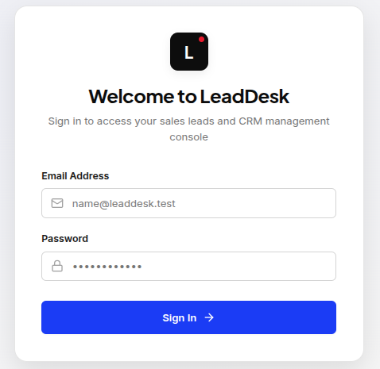
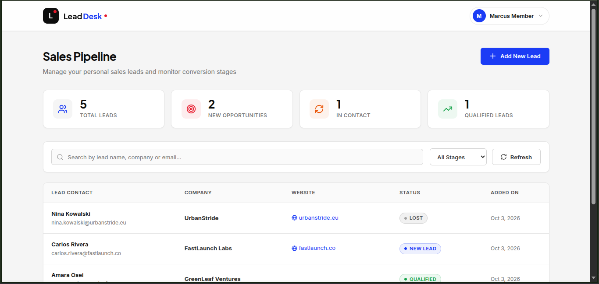
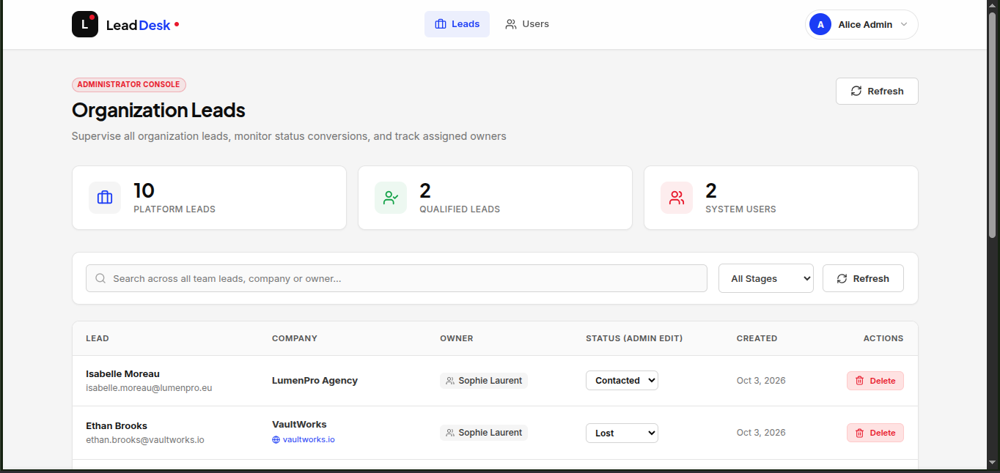
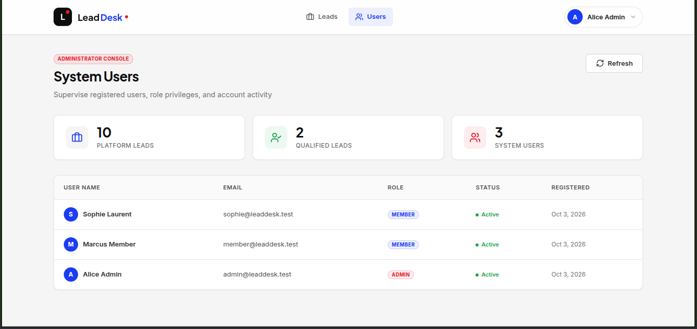

# Lead Desk

Lead Desk is a small web app where users can log in and manage sales leads. There are two roles — **admin** and **member**. A member can only see and add their own leads. An admin can see all leads from all users and also see the full list of users. The app uses JWT tokens stored in httpOnly cookies so tokens are never readable by JavaScript. Everything runs inside Docker — you do not need to install Python, Node.js, or PostgreSQL on your machine.

---

## Tech Stack

| Layer | Choice | Why |
|---|---|---|
| Backend | **FastAPI** (Python 3.12) | Fast, simple, async support, great for REST APIs |
| ORM / Migrations | **SQLModel + Alembic** | SQLModel combines Pydantic and SQLAlchemy nicely; Alembic handles migrations properly |
| Password hashing | **pwdlib (argon2 + bcrypt)** | Argon2 is the modern standard for password hashing |
| Auth tokens | **PyJWT** | Lightweight, does exactly what we need |
| Frontend | **Next.js 16 + TypeScript** | React framework with server-side support, good routing |
| HTTP client | **Native fetch with credentials** | Keeps things simple, no extra library needed |
| Toasts / Notifications | **Sonner** | Clean toast library for React |
| Icons | **Lucide React** | Consistent icon set |
| Database | **PostgreSQL 17** | Reliable, well-supported, required by the task |
| Package manager (backend) | **uv** | Fast Python package manager |
| Reverse Proxy | **Nginx** (Alpine Unprivileged) | Serves the frontend and backend `/api` under a single origin (`http://localhost`), eliminating CORS issues |
| CORS | Handled by FastAPI middleware | Configured for `http://localhost` with credentials enabled |

---

## Prerequisites

You only need these two things installed on your machine:

- [Docker](https://docs.docker.com/get-docker/)
- [Docker Compose](https://docs.docker.com/compose/install/) (comes with Docker Desktop)

Nothing else. No Python, no Node.js, no database setup.

---

## How to Run

### With `make` (easier)

```bash
# 1. Copy the example env file
cp .env.example .env

# 2. Start everything
make up
```

To stop:

```bash
make down
```

Other useful commands:

```bash
make logs        # see live logs from all containers
make ps          # see which containers are running
make dev         # start with hot-reload for development
make help        # see all available commands
```

### Without `make` (plain Docker Compose)

```bash
# 1. Copy the example env file
cp .env.example .env

# 2. Build and start all containers in the background
docker compose up --build -d
```

To stop:

```bash
docker compose down --volumes --remove-orphans
```

Wait about 15–20 seconds after starting for all containers to become healthy. The frontend waits for the backend, and the backend waits for the database.

---

## URLs and Login Credentials

Once the app is running, open these in your browser:

| Service | URL | Description |
|---|---|---|
| **App & API (Single Origin)** | **http://localhost** | Served by Nginx reverse proxy (Next.js frontend + `/api` on one origin) |
| API docs (Swagger via Proxy) | http://localhost/docs | Interactive API docs through reverse proxy |
| OpenAPI Schema (via Proxy) | http://localhost/openapi.json | OpenAPI specification through reverse proxy |

### Seed Login Credentials

Use these pre-seeded accounts to test different roles:

| Role | Email | Password | Landing Page | Permissions |
|---|---|---|---|---|
| **Admin** | `admin@leaddesk.test` | `Admin@123` | `/admin` | Can see all leads across all users & view all registered users |
| **Member** | `member@leaddesk.test` | `Member@123` | `/dashboard` | Can only view and create their own leads |
| **Member** | `sophie@leaddesk.test` | `Sophie@123` | `/dashboard` | Can only view and create their own leads |

The seed runs automatically when the backend starts. You do not need to run anything manually.

---

## How to Run the Tests

### With `make`

```bash
make test
```

Or run tests and then clean up containers and volumes automatically:

```bash
make test-clean
```

### Without `make`

```bash
docker compose -f docker-compose.test.yml up --build \
  --abort-on-container-exit \
  --exit-code-from backend-test
```

The tests run inside Docker so you do not need to install anything locally. The test suite covers login, token refresh, role-based access, and lead ownership.

---

## Environment Variables

Copy `.env.example` to `.env` before starting. Here is what each variable does:

| Variable | Description |
|---|---|
| `POSTGRES_USER` | Database username |
| `POSTGRES_PASSWORD` | Database password |
| `POSTGRES_DB` | Database name |
| `DATABASE_URL` | Full connection string used by the backend |
| `JWT_SECRET` | Secret key used to sign JWT tokens (access and refresh keys are securely derived from this) — change this in production |
| `ACCESS_TOKEN_TTL_MINUTES` | How long an access token is valid (default: 15 minutes) |
| `REFRESH_TOKEN_TTL_DAYS` | How long a refresh token is valid (default: 7 days) |
| `SECURE_COOKIES` | Set to `true` in production (HTTPS only); keep `false` for local HTTP |
| `NGINX_PORT` | Host port mapped to the Nginx reverse proxy (default: `80`) |
| `FRONTEND_ORIGIN` | The URL of the frontend, used for CORS (default: `http://localhost`) |
| `INTERNAL_API_URL` | The backend URL used by Next.js server-side (inside Docker network) |
| `NEXT_PUBLIC_API_URL` | The backend URL used by the browser (public-facing) |

> **Never commit your real `.env` file.** Only `.env.example` (with fake values) is in the repo.

---

## API Endpoints

All endpoints use the `/api` prefix.

| Method | Endpoint | Access | What it does |
|---|---|---|---|
| `GET` | `/api/health` | Public | Returns 200 when the server is up. Used by Docker healthcheck. |
| `POST` | `/api/auth/login` | Public | Checks email + password. Sets httpOnly cookies. Returns user info. |
| `POST` | `/api/auth/refresh` | Refresh cookie | Issues new access + refresh tokens. Old refresh token is revoked. |
| `POST` | `/api/auth/logout` | Logged in | Revokes refresh token on server. Clears both cookies. |
| `GET` | `/api/auth/me` | Logged in | Returns the current logged-in user and their role. |
| `GET` | `/api/leads` | Logged in | Member: own leads only. Admin: all leads with owner name. |
| `POST` | `/api/leads` | Logged in | Creates a new lead owned by the current user. |
| `GET` | `/api/admin/users` | Admin only | Returns all users (no password hashes). Member gets 403. |

Errors always come back in this shape: `{ "error": "message here" }`. No stack traces are ever returned.

---

## Screenshots

### 1. Login Page


### 2. Member Dashboard (`/dashboard`)
Shows only member's own leads and the "Add lead" form:


### 3. Admin Page (`/admin`)
Shows all leads across all members (with owner details) and user management list:




---

## Explanation

### Auth Flow

When a user logs in, the backend checks the email and password. If correct, it creates two JWTs — an access token (lives 15 minutes) and a refresh token (lives 7 days). Both are sent as httpOnly cookies, so JavaScript can never read them. The browser sends them automatically with every request.

When the access token expires and a request comes back as 401, the frontend makes one call to `/api/auth/refresh`. If the refresh token is still valid, the backend issues a brand new pair of tokens (token rotation). The old refresh token is immediately marked as revoked in the database, so it cannot be used again. If someone tries to reuse an old refresh token, the request is rejected.

When the user logs out, the backend revokes the refresh token in the database and clears both cookies.

### Refresh Handling (No Double Refresh)

The frontend keeps a single variable that holds the in-progress refresh promise. If multiple requests fail with 401 at the same time, only the first one starts a refresh call. The others wait for that same promise to resolve, then retry their original requests. This way, only one refresh call is ever made at a time.

### Role-Based Access

Roles are checked on the backend for every protected endpoint. The frontend never trusts itself alone. On the backend, a dependency reads the access token from the cookie, decodes it, and checks the role before the route handler runs. On the frontend, after login the user is redirected based on their role — admin goes to `/admin`, member goes to `/dashboard`. If a member tries to open `/admin`, they are sent to `/forbidden`. On page reload, the app calls `/api/auth/me` to restore the session silently.

### Docker Setup

The four services start in strict dependency order: `db` first (PostgreSQL), then `backend` (waits for `db` to pass its healthcheck), then `frontend` (waits for `backend` to pass its healthcheck), and finally `proxy` (Nginx reverse proxy, which starts only after both backend and frontend are healthy). This is enforced using `depends_on` with `condition: service_healthy` across `docker-compose.yml`.

All application Dockerfiles run strictly as unprivileged non-root users (`USER` instruction: `appuser` for backend, `nextjs` for frontend, and `nginx` for proxy). The database, backend, and frontend ports are not published to the host — the single public entrypoint is port 80 handled by Nginx.

### Decisions and Trade-offs

I chose FastAPI because it is fast to write, async by default, and has good validation built in through Pydantic. SQLModel is nice because the same model class works for both the database and the API schema. For the frontend, Next.js is a solid choice because it handles routing well and TypeScript support is built in.

For production architecture, I implemented a single Nginx reverse proxy in Compose that serves both the frontend and the `/api` endpoints on one origin (`http://localhost`). This eliminates cross-origin complexity in the browser, ensures cookies are strictly same-origin, supports WebSocket upgrades for Next.js HMR, and routes Swagger docs and OpenAPI specs cleanly.

### What is Not Finished

- No rate limiting on `/api/auth/login`
- No pagination or search/filter on the leads table
- No GitHub Actions workflow
- No frontend tests

### AI Tools Used

I used an AI coding IDE `Antigravity` to help write boilerplate code, draft the seed data, structure the Docker files. All logic was reviewed and understood before committing. I can explain every part of the code.
